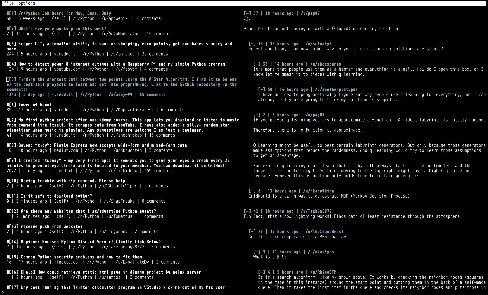

# snooski

## what?

Snooski is a terminal reddit browser, built with [urwid](https://pypi.org/project/urwid/) and [PRAW](https://pypi.org/project/praw/).




## install?

To install:

```
$ git clone https://github.com/pkage/snooski
$ cd snooski
$ virtualenv env_snooski -p python3 && source env_snooski/bin/activate # (optional)
$ pip3 install -r requirements.txt
```

And to run:

```
$ python3 snooski.py
```

It was built at university for limited environments, so doesn't include an
system-wide installation. If you want, you can link a shell script that launches
snooski onto your `$PATH`.


